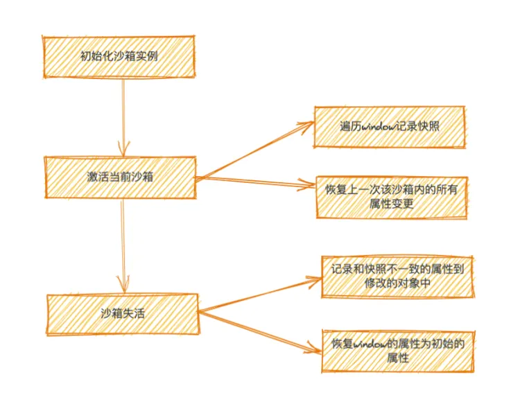
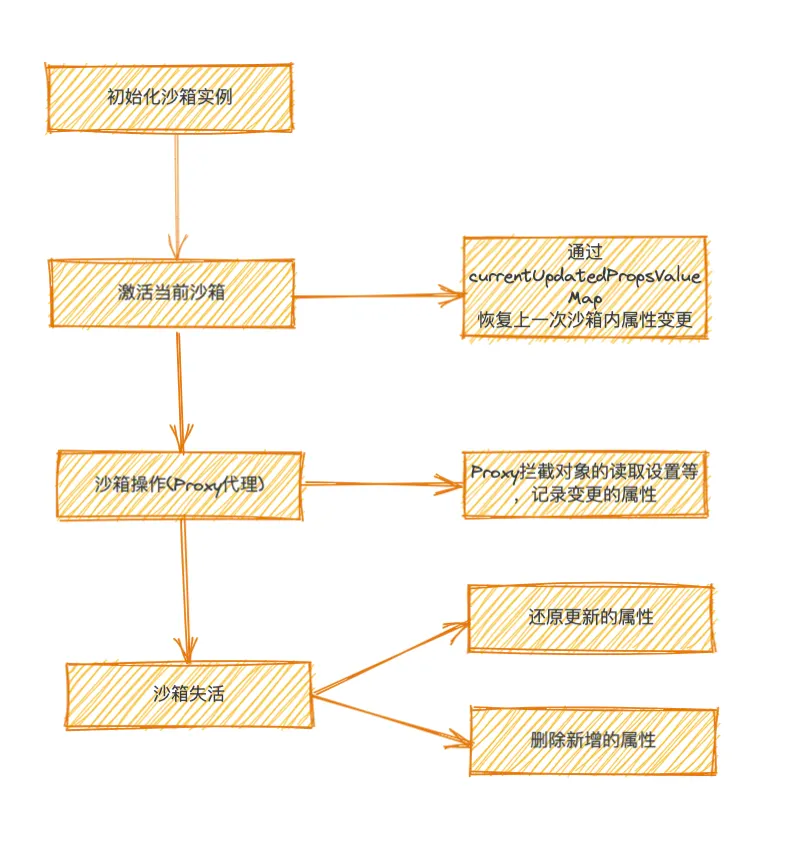
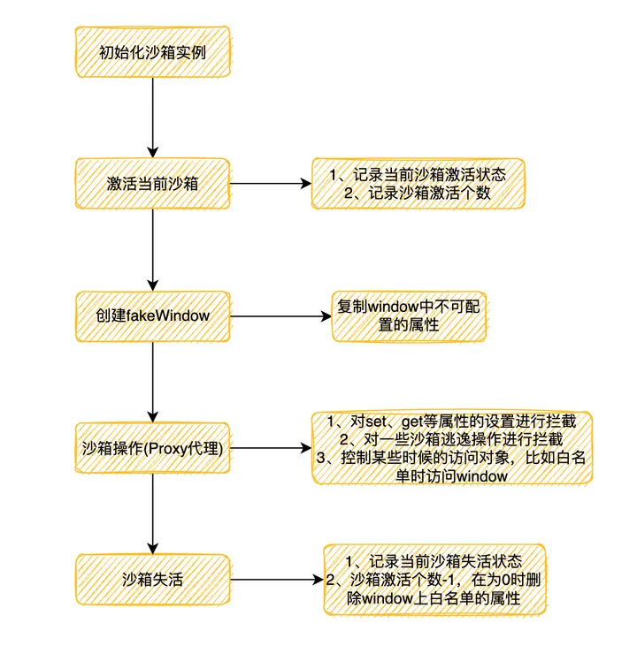

# qiankun

## Js隔离

### 沙箱快照 - SnapshotSandbox
缺点：
- 遍历window上的所有属性，性能差
- 同一时间只能激活一个微应用
- 污染全局window

优点：
- 兼容性高
  
```js
// 简易实现
class SnapshotSandbox {
    constructor() {
        this.fakeWindow = {}

        this.modifyWindow = {}
    }

    active () {
        // 保存window快照
        for (let prop in window) {
            this.fakeWindow[prop] = window[prop]
        }

        // 把缓存的上次快照还原回window
        Object.keys(this.modifyWindow).forEach((prop) => {
            window[prop] = this.modifyWindow[prop]
        })
    }

    // 失活，把当前window负值给缓存window
    inactive () {
        for (let prop in window) {
            if (window.hasOwnProperty(prop)) {
                // 两者不相同，表示修改了某个 prop 记录当前在 window 上修改了的 prop
                if (window[prop] !== this.modifyWindow[prop]) {
                    this.modifyWindow[prop] = window[prop]
                }

                // 还原window
                window[prop] = this.fakeWindow[prop]
            }
        }
    }
}
```

### Legacy沙箱 - LegacySandbox（单例）

```js
const  isPropConfigurable = (target, prop) => {
    const descriptor = Object.getOwnPropertyDescriptor(target, prop);
    return descriptor ? descriptor.configurable : true;
}

class LegacySandbox {
    constructor(name, globalContext) {
        this.name = name
        this.globalContext = globalContext
        // 沙箱期间新增的全局变量
        this.addedPropsMapInSandbox = new Map()

        // 沙箱期间更新的全局变量
        this.modifiedPropsOriginValueMapInSandBox = new Map()

        // 持续记录更新的全局变量的map
        this.currentUpdatedPropsValueMap = new Map()
        this.sandboxRunning = false

        const rawWindow = globalContext
        const fakeWindow = Object.create(null)

        const setTrap = () => {}

        const proxy = new Proxy(fakeWindow, {
            set: (_, key, value) => {
                const originValue = rawWindow[key]

                // 把变更的属性同步到addedPropsMapInSandbox、modifiedPropsOriginalValueMapInSandbox以及currentUpdatedPropsValueMap
                return setTrap(key, value, originValue)
            },
            get: (_, key) => {
                // 防止通过使用top、parent、window、self访问外层真实的环境
                if (key === 'top' || key === 'parent' || key === 'window' || key === 'self') {
                    return proxy;
                }
                const value = rawWindow[p];
                return value
            }
        })
    }

    active () {
        if (this.sandboxRunning) {
            // 把上一次沙箱激活时的变更，设置到window上
            this.currentUpdatedPropsValueMap.forEach((value, key) => {
                
                this.setWindowProp(key, value)
            })
        }
        this.sandboxRunning = true
    }

    inactive () {
        // 遍历修改过的属性，重新还原回初始值
        this.modifiedPropsOriginValueMapInSandBox.forEach((value, key) => {
            this.setWindowProp(key, value)
        })
        // 遍历新增的属性，重新在window上移除
        this.addedPropsMapInSandbox.forEach((value, key) => {
            this.setWindowProp(key, undefined, true)
        })

        this.sandboxRunning = false;
    }

    setWindowProp(prop, value, isDel) {
        if (value === undefined && isDel) {
            delete this.globalContext[prop]
            // 全局对象上属性可变更
        } else if (isPropConfigurable(this.globalContext, prop) && typeof prop !== 'symbol') {
            Object.defineProperty(this.globalContext, prop, { writable: true, configurable: true })
            this.globalContext[prop] = value
        }
    }
}
```
- 不需要遍历window上所有的属性，直接通过proxy代理来实现copy
- 虽然基于proxy实现，但仍然污染了window，因为变更点依旧是以window为基础，同一时间只能运行一个应用(还是在通过切换新增删除代理的proxyWindow里的属性来实现子应用的切换)
只维护了一个window
### Proxy沙箱 - ProxySandbox

- 基于 proxy 代理对象，不需要遍历 window，性能要比快照沙箱好
- 支持多个应用
- 没有污染全局 window
- 应用失活后，依然可以获取到激活时定义的属性。

首先我们需要创建一个window副本fakeWindow和propertiesWithGetter，后一个是用来记录有getter且不可配置的Map对象，具体实现参考proxy中的get部分
```ts
function createFakeWindow(globalContext: Window) {
    // 记录 window 对象上的 getter 属性，原生的有：window、document、location、top
  const propertiesWithGetter = new Map<PropertyKey, boolean>();
  const fakeWindow = {} as FakeWindow;

  Object.getOwnPropertyNames(globalContext)
        // 遍历出window上所有不可配置的属性
    .filter((p) => {
      const descriptor = Object.getOwnPropertyDescriptor(globalContext, p);
      return !descriptor?.configurable;
    })
    .forEach((p) => {
            // 获取属性描述符
      const descriptor = Object.getOwnPropertyDescriptor(globalContext, p);
      if (descriptor) {
        const hasGetter = Object.prototype.hasOwnProperty.call(descriptor, 'get');
        if (
          p === 'top' ||
          p === 'parent' ||
          p === 'self' ||
          p === 'window' ||
          (process.env.NODE_ENV === 'test' && (p === 'mockTop' || p === 'mockSafariTop'))
        ) {
          descriptor.configurable = true;

          if (!hasGetter) {
            descriptor.writable = true;
          }
        }

        if (hasGetter) propertiesWithGetter.set(p, true);
                // 冻结某个属性，冻结以后该属性不可修改
        rawObjectDefineProperty(fakeWindow, p, Object.freeze(descriptor));
      }
    });

  return {
    fakeWindow,
    propertiesWithGetter,
  };
}
```
该模式最具优势的一点是操作基于window上拷贝的副本FakeWindow，从而保证了多个沙箱实例并行的情况。

## Css隔离
### strictStyleIsolation
strictStyleIsolation 模式下 qiankun 会为每个微应用的容器包裹上一个 shadow dom 节点，所有的子应用都被 #shadow-root 所包裹，从而确保微应用的样式不会对全局造成影响。
但是这种方式在react中会有一定的问题，因为React事件在 Shadow DOM 中根本不起作用。还有如果像弹框被系统挂在在主应用body下样式也会失效。

### experimentalStyleIsolation
experimentalStyleIsolation 被设置为 true 时，qiankun 会改写子应用所添加的样式为所有样式规则增加一个特殊的选择器规则来限定其影响范围