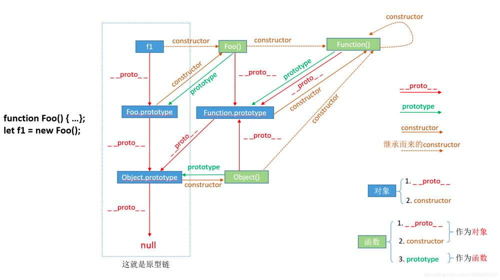

# 原型模式
我们创建的每一个函数都有一个`prototype`属性，这个属性是一个指针，指向一个对象，而这个对象的用途是包含可以由**特定类型的所有实例共享的属性和方法**。
```js
function Person () {}

Person.prototype.name = 'Zhangsan'
Person.prototype.age = 18
Person.prototype.sayName = function () {
    console.log(this.name, this.age)
}

const person = new Person()
person.sayName() // Zhangsan 18
```
**注意：与构造函数不同，新对象的这些属性和方法是由所有实例共享的。**

## 原型对象
原型最初只包含 constructor 属性，而该属性也是共享的，因此可以通过对象实例访问。 
虽然可以通过对象实例访问保存在原型中的值，但却**不能通过对象实例重写原型中的值**。
如果我们在实例中添加了一个属性，而该属性与实例原型中的一个属性同名，那我们就在实例中创建该属性，该属性将会屏蔽原型中的属性。
```js
function Person(){}

Person.prototype.name = 'Nicholas';
Person.prototype.age = 29;
Person.prototype.job = 'Software Engineer';
Person.prototype.sayName = function(){
console.log(this.name);
};

const person1 = new Person();
const person2 = new Person();

person1.name = 'Greg';
console.log(person1.name);
// 'Greg' 		// from instance
console.log(person2.name);
// 'Nicholas' 	// from prototype
```

## 原型的动态性
由于在原型中查找值的过程是一次搜索，因此我们对原型对象所做的任何修改都能够立即从实例上反映出来，即使是先创建了实例后修改原型也照样如此。 
实例与原型之间的关系是松散的，重写原型对象切断了现有原型与任何之前已经存在的对象实例之间的联系，它们引用的仍然是最初的原型。
```js
function Person(){}

const friend = new Person();

Person.prototype = {
  constructor: Person,
  name: 'Nicholas',
  age: 29,
  job: 'Software Engineer',
  sayName: function (){
    console.log(this.name);
  }
};

friend.sayName();
// error
```
## 原型对象的缺点
原型中的所有属性是被很多实例共享的，这种共享对于函数非常合适。对于那些包含基本值的属性倒也说得过去，毕竟，通过在实例上添加一个同名属性，可以隐藏原型中的对应属性。然而，对于包含引用类型值的属性来说，问题就比较突出了。
```js
function Person(){}

Person.prototype = {
  name: 'Nicholas',
  age: 29,
  job: 'Software Engineer',
  friends: ['Shelby', 'Court'],
  sayName: function (){
    console.log(this.name);
  }
}

const person1 = new Person();
const person2 = new Person();

person1.friends.push('Van');

console.log(person1.friends);
// 'Shelby,Court,Van'
console.log(person2.friends);
// 'Shelby,COurt,Van'
console.log(person1.friends == person2.friends);
// true
person1.friends.push('Lucy')
console.log(person1.friends, person2.friends)
// 'Shelby,COurt,Van,Lucy'
```
## 原型链

在 JavaScript 中，`prototype`、`__proto__` 和 `constructor`这三者之间依附在不同的引用对象类型上。
- 对象：`__proto__` 和 `constructor` 是对象独有的。
- 函数：prototype 是函数独有的。但是函数也是对象，所以函数也有 `__proto__` 和 `constructor`。
### 原型式继承
原型式继承是借助原型基于已有的对象创建新对象，同时还不必因此创建自定义类型。
在函数内部，先创建 临时性的构造函数，然后将传入的对象作为这个 构造函数的原型，最后返回这个临时构造函数的一个实例。从本质上，该函数对传入的对象执行了一次 `浅拷贝`。
```js
function Person(friendship) {
  function Creator() {}
  Creator.prototype = friendship;
  return new Creator();
}

// 作为另一个对象的基础
const friendship = {
    name: 'unamed',
    friends: ['Amy', 'Ben', 'Tom'],
};

// 返回新实例对象，该实例对象原型为 Person
let uzi = Person(friendship);
uzi.name = 'Uzi';
uzi.friends.push('Peter');

let kat = Person(friendship);
kat.name = 'Kat';
kat.friends.push('Sid');

// 原型中的基本类型属性和引用类型属性被两个实例对象共享
console.log(uzi.friends);
// ["Amy", "Ben", "Tom", "Peter", "Sid"]
```
