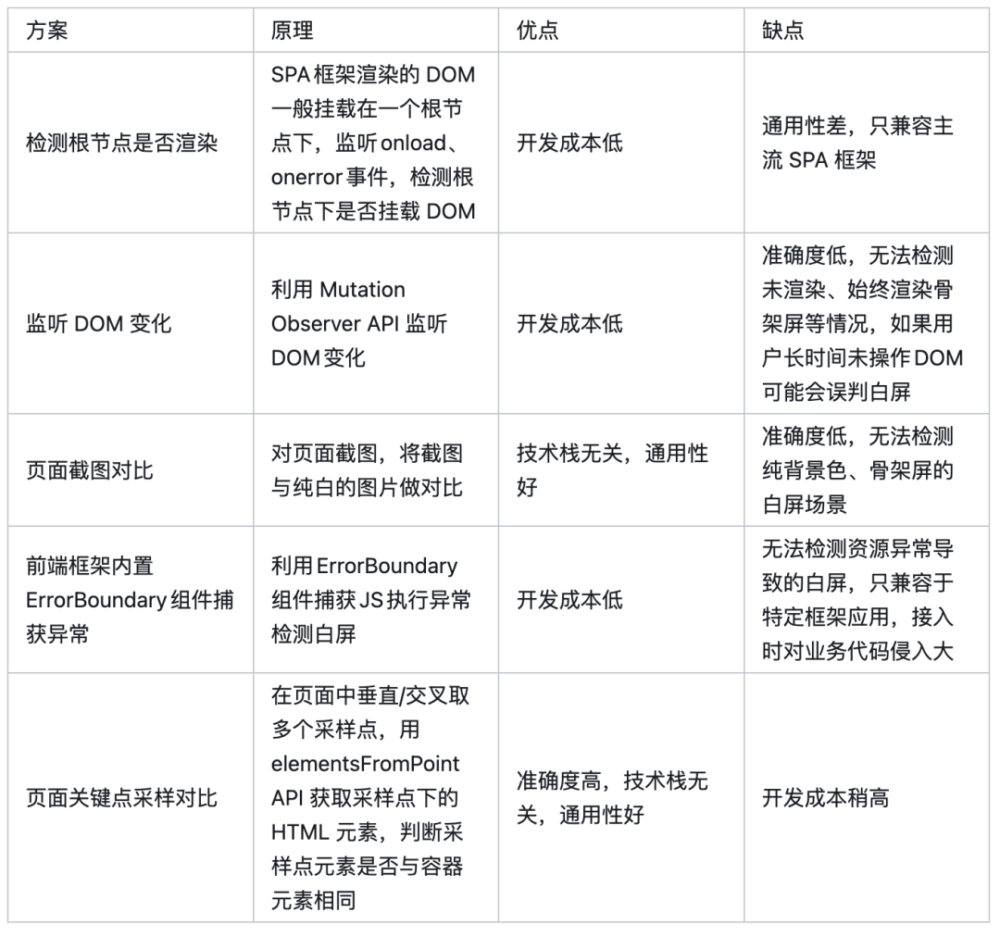

## 页面白屏表现行为
- 页面空白或仅显示背景色，没有实际内容
- 页面一直展示骨架屏，包括页面 loading 状态
- 页面只展示导航菜单，内容区空白，包括微前端或 iframe 嵌套子页面的场景

导致白屏的原因分两种：资源加载错误、代码执行错误。

## 解决方案


### 屏幕选点采样方式
采用"米"字取点规则，利用 `requestIdleCallback` 在浏览器空闲时计算。  

#### 采样执行时机
- document.readyState 在 complete 时或 load 事件触发时
- 全局 error 事件触发时
```js
// react
import React from 'react'
class ErrorPage extends React.Component {
    componentDidCatch(error, errorInfo) {
        // upload error
    }
}

// 原生
window.onerror = function(message, source, lineno, colno, error) {  }
```
- 全局 unhandledrejection 事件触发时
#### 采样代码
`elementsFromPoint`该函数返还在特定坐标点下的 HTML 元素数组`elementsFromPoint(x, y)`
```js
for (let i = 1; i <= 9; i++) {
   // x轴采样点
   const xElements = document?.elementsFromPoint((window.innerWidth * i) / 10, window.innerHeight / 2);
   // y轴采样点
   const yElements = document?.elementsFromPoint(window.innerWidth / 2, (window.innerHeight * i) / 10);
   // 上升的对角线采样点
   const upDiagonalElements = document?.elementsFromPoint(
     (window.innerWidth * i) / 10,
     (window.innerHeight * i) / 10,
   );
   // 下降的对角线采样点
   const downDiagonalElements = document?.elementsFromPoint(
     (window.innerWidth * i) / 10,
     window.innerHeight - (window.innerHeight * i) / 10,
   );

   if (this.isContainer(xElements[0])) emptyPoints++;

   // 中心点只计算一次
   if (i !== 5) {
     if (this.isContainer(yElements[0])) emptyPoints++;
     if (this.isContainer(upDiagonalElements[0])) emptyPoints++;
     if (this.isContainer(downDiagonalElements[0])) emptyPoints++;
   }
 }
```