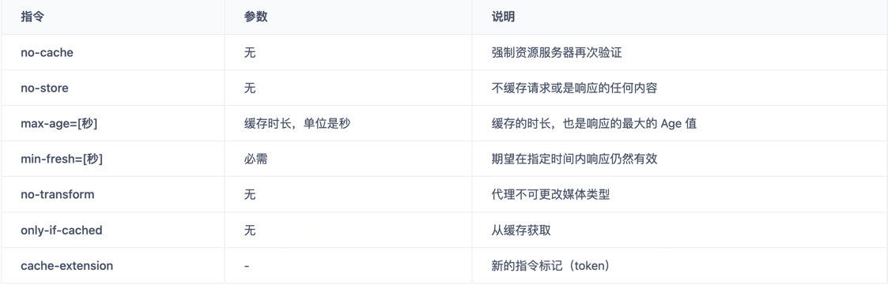
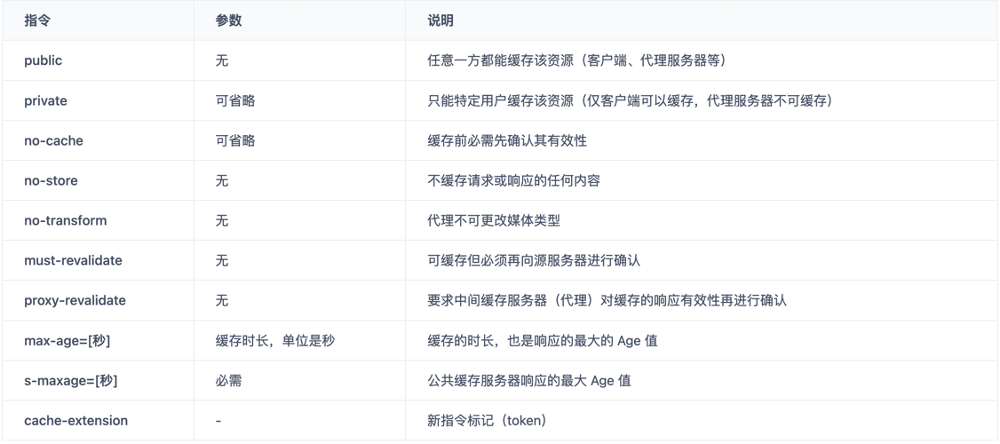

## 1、从输入URL到页面加载的全过程
### Step1: DNS解析
先本地，再逐级查询远端域名服务器
### Step2: 建立TCP链接
### Step3: 发送HTTP请求
### Step4: 服务器处理请求并返回HTTP报文
### Step5: 浏览器解析渲染页面
浏览器是一个边解析边渲染的过程。首先浏览器解析HTML文件构建DOM树，然后解析CSS文件构建渲染树，等到渲染树构建完成后，浏览器开始布局渲染树并将其绘制到屏幕上。这个过程比较复杂，涉及到两个概念: reflow(回流)和repain(重绘)。DOM节点中的各个元素都是以盒模型的形式存在，这些都需要浏览器去计算其位置和大小等，这个过程称为relow;当盒模型的位置,大小以及其他属性，如颜色,字体,等确定下来之后，浏览器便开始绘制内容，这个过程称为repain。页面在首次加载时必然会经历reflow和repain。reflow和repain过程是非常消耗性能的，尤其是在移动设备上，它会破坏用户体验，有时会造成页面卡顿。所以我们应该尽可能少的减少reflow和repain。
### Step6: 连接结束


## 2、浏览器的缓存机制 强制缓存 && 协商缓存
浏览器发送请求，先判断浏览器本地是否有缓存，若没有缓存则发送请求到服务端，服务端响应后把结果缓存在浏览器。
但这里的缓存又分为强缓存与协商缓存：

|HTTP 缓存   | HTTP 状态码 | 缓存位置  | 谁来决定  |
|---|----------|---|---|
| 强缓存  | 200      | 本地浏览器  |  本地浏览器 |
| 协商缓存  | 304      | 本地浏览器  | 服务器  |

### 强缓存
**强缓存就是向浏览器缓存查找该请求结果，并根据该结果的缓存规则来决定是否使用该缓存结果的过程。**

强缓存一般分为三种：  
1、不存在该缓存结果和缓存标识，强制缓存失效，则直接向服务器发起请求（跟首次发起请求一致）  
2、存在该缓存结果和缓存标识，但该结果已失效，强缓存失效，则使用协商缓存（暂不分析）  
3、存在该缓存结果和缓存标识，且该结果尚未失效，强制缓存生效，直接返回该结果

```shell
Age:23146
Cache-Control: max-age=2592000
Date: Tue, 28 Nov 2017 12:26:41 GMT
ETag: W/"5a1cf09a-63c6"
Expires: Thu, 28 Dec 2017 05:27:45 GMT
Last-Modified: Tue, 28 Nov 2017 05:14:02 GMT
Vary: Accept-Encoding
```
#### 如何开启强缓存呢？规则是怎样的？  
当浏览器向服务器发起请求时，服务器会将缓存规则放入 HTPP 响应报文的响应头（HTTP Header）中和请求结果一起返回给浏览器，
控制强制缓存的字段分别是 Expires 和 Cache-Control，其中 Cache-Control 优先级比 Expires 高。

#### 浏览器缓存至何处？如何在浏览器中判断强制缓存是否生效？  
内存缓存（from memory cache）和硬盘缓存（from disk cache）对比

- 内存缓存（from memory cache）：内存缓存具有两个特点，分别是快速读取和时效性
  - 快速读取：内存缓存会将编译解析后的文件，直接存入该进程的内存中，占据该进程的内存中，占据该进程一定的内存资源，以便下次运行使用时的快速读取 
  - 时效性：一旦该进程关闭，则该进程的内存则会清空
- 硬盘缓存（from disk cache）：硬盘缓存则是直接将缓存写入硬盘文件中，读取缓存需要对该缓存存放的硬盘文件进行 I/O 操作，然后重新解析该缓存内容，读取复杂，速度比内存缓存慢。

#### 那些文件用内存缓存，那些文件用硬盘缓存？  
在浏览器中，浏览器会在 JavaScript 脚本和图片等文件解析后直接存入内存缓存中，那么刷新页面时只需直接从内存缓存中读取（from memory cache）；  
而 CSS 文件则会存入硬盘文件中，所以每次渲染页面都需要从硬盘读取缓存（from disk cache）。

#### Catch-Control和Expires
Expires 设置是一个绝对时间，该字段值为 GMT 格式的时间字符串，如果当前时间超过设置时间，则重新发起请求
```shell
Expires: Thu, 28 Dec 2017 05:27:45 GMT
```
但这种方式有一种缺陷，这个时间是无法区分比对时区的，如果服务端与客户端跨时区，可能会出现Expires永久失效的情况。
为避免这种情况的发生，所以在HTTP1.1中改为了使用Catch-Control来控制。

Cache-Control


响应指令：


**⚠️no-cache 指令很多人误以为是不缓存，这是不准确的，no-cache 的意思是可以缓存，但每次使用缓存前应该去向服务器验证缓存是否可用。no-store 才是不缓存内容。另外部分指令也可以组合使用。**
### 协商缓存
协商缓存即强制缓存失效后，浏览器携带缓存标识向服务器发起请求，由服务器根据缓存标识决定是否使用缓存的过程。

- 在第一次请求服务器时，服务器会返回资源，并且返回一个资源的缓存标识，一起存到浏览器的缓存数据库。
- 当第二次请求资源时，浏览器会首先将缓存标识发送给服务器，服务器拿到标识后判断标识是否匹配 
  - 如果缓存标识不匹配，表示资源有更新，服务器会将新数据和新的缓存标识一起返回到浏览器 
  - 如果缓存标识匹配，表示资源没有更新，并且返回 304 状态码，浏览器就读取本地缓存服务器中的数据。

协商缓存首部字段包括：
- HTTP/1.0 
  - 资源响应头：Last-Modified 
  - 协商请求头：If-Modified-Since、If-Unmodified-Since
- HTTP/1.1 
  - 资源响应头：ETag 
  - 协商请求头：If-None-Match、If-Match

在HTTP/1.0中使用Last-Modified存在一个问题，因为他是通过修改时间来判断资源是否被修改，如果我一个资源先修改了，然后又改回去了，
这样协商缓存是无法被命中的，虽然内容没有任何变跟，所以后来新增了ETag这个响应头来判断，ETag是服务器会根据资源计算出一个哈希值。
### 总结

