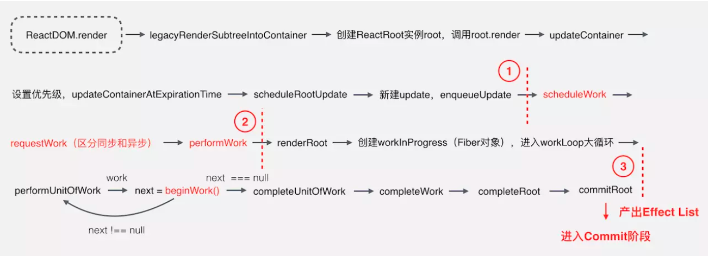

### 1、React父子组件如何通信
- props
- Context
- ref、forwardRef
- useReducer
- redux
### 2、Fiber架构

### 3、React中的任务调度

### 4、useEffect和useLayoutEffect区别
- useEffect 是异步执行的，而useLayoutEffect是同步执行的。
- useEffect 的执行时机是浏览器完成渲染之后，而 useLayoutEffect 的执行时机是浏览器把内容真正渲染到界面之前，和 componentDidMount 等价。

因为useLayoutEffect是同步的所以会阻塞DOM渲染，所以一般都在执行完回调后再进行渲染，因此看起来在useLayoutEffect里操作dom不会导致屏幕闪烁。

### 5、为什么在18之前有的setState是同步的，有的是异步的？
在react18之前，因为setState的合并是半自动的，在合适时机使用batchedUpdates合并setState的变更，所以先setState变更的值，需要等到所有setState合并过后
才会做出更新，这样看起来就是异步的。但是当我们用setTimeout包裹时，早已跳除了batchedUpdates调用栈，executionContext已不包含BatchedContext,所以此时
触发的更新不会主动批量更新

### 6、Fiber工作流程
1. ReactDOM.render() 和 setState 的时候开始创建更新
2. 将创建的更新加入任务队列，等待调度
3. 在 requestIdleCallback 空闲时执行任务
4. 从根节点开始遍历 Fiber Node，并且构建 WorkInProgress Tree
5. 生成 EffectList
6. 根据 EffectList 更新 DOM

1. 第一部分从 ReactDOM.render 方法开始，把接收的 React Element 转换为 Fiber 节点，并为其设置优先级，创建 Update，加入到更新队列，这部分主要是做一些初始数据的准备。
2. 第二部分主要是三个函数：scheduleWork、requestWork、performWork，即安排工作、申请工作、正式工作三部曲，React16 新增的异步调用的功能则在这部分实现，这部分就是 Schedule 阶段，前面介绍的 Cooperative Scheduling 就是在这个阶段，只有在这个解决获取到可执行的时间片，第三部分才会继续执行。
3. 第三部分是个大循环，遍历所有的 Fiber 节点，通过 Diff 算法计算所有更新工作，产出 EffectList 给到 Commit 阶段使用，这部分的核心就是 beginWork 函数，这部分基本就是 FIber Reconciler，包括 reconciliation 和 commit 阶段。

