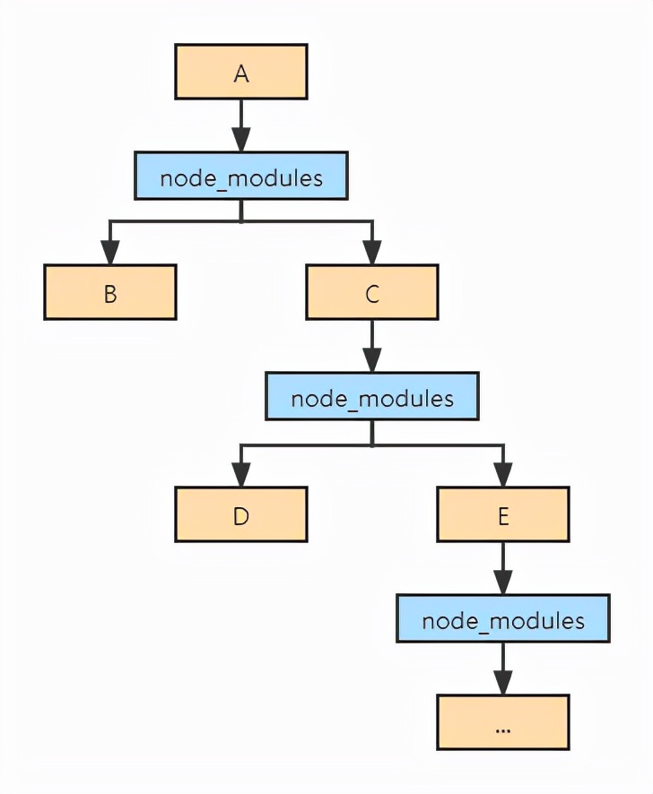
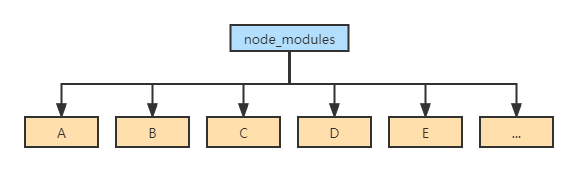
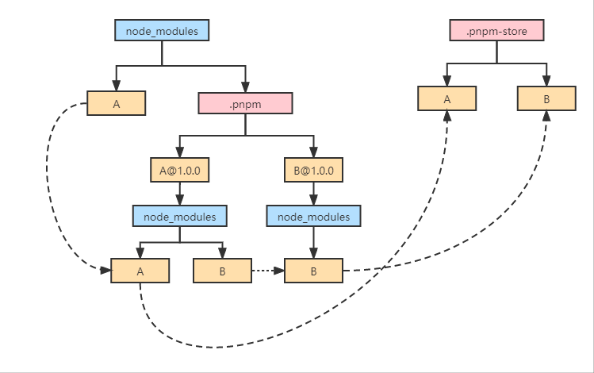
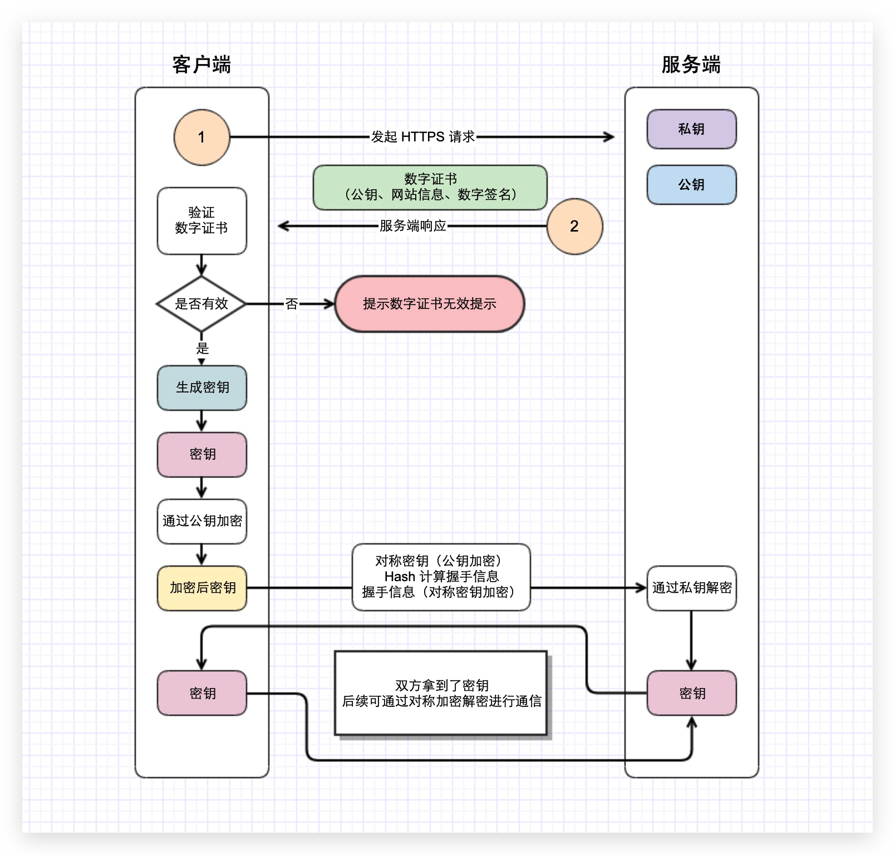
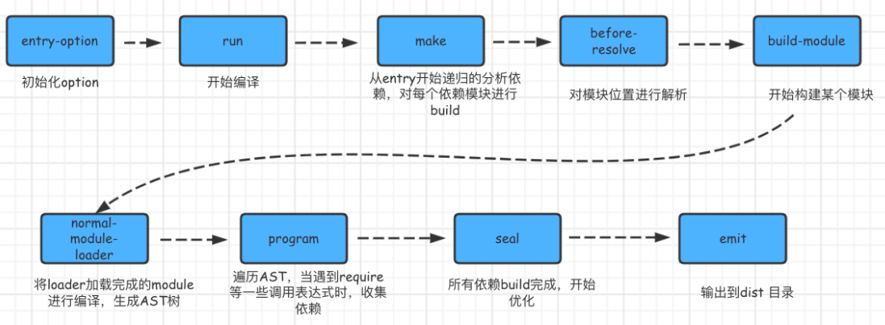
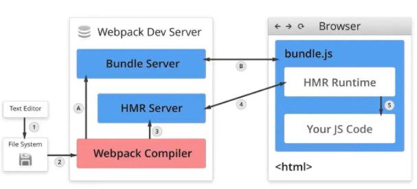

## npm yarn pnpm有什么区别
### 依赖解决了什么问题
依赖(dependency)是别人为了解决一些问题而写好的代码，即我们常说的第三方包或三方库。一个项目或多或少的会有一些依赖，而你安装的依赖又可能有它自己的依赖。

### npmv1-v2
初代npm(Node.js Package Manager)随着Node.js的发布出现了。 它的文件结构是嵌套:

**缺点：**

1、node_modules体积过大(大量重复的包被安装)  
2、node_modules嵌套层级过深(会导致文件路径过长的问题)  
3、模块实例不能共享
### yarn & npm v3
yarn和npm v3带来了扁平化依赖管理：

**缺点：**

1、依赖结构的不确定性  
2、扁平化算法本身复杂性很高，耗时较长  
3、项目中仍然可以非法访问没有声明过依赖的包

### pnpm
pnpm是按内容寻址的，采用硬链接和符号链接所有的本地缓存源文件，yarn的话是直接复制的， 一个内容寻址，一个复制内容，可想而知，这就是pnpm运行为什么比yarn还快的原因。

1、安装依赖  
A和B一起放到.pnpm中(和上面相比，这里没有耗时的扁平化算法)，另外A@1.0.0下面是node_modules，然后才是A，这样做有两点好处：  
- 允许包引用自身
- 把包和它的依赖摊平，避免循环结构

2、处理间接依赖 ，A平级目录创建B，B指向B@1.0.0下面的B。  
3、处理直接依赖，顶层node_modules目录下创建A，指向A@1.0.0下的A。

## HTTP CORS 跨域资源共享
跨域资源共享简称（CORS）是一种机制，它是用额外的请求头来告知浏览器，让运行在相同域上的 Web 应用被准许访问来自不同源服务器上的指定的资源。当一个资源从与该资源本身所在的服务器不同的域、协议或端口请求一个资源时，资源会发起一个跨域 HTTP 请求。
### 什么是同源？
同源是指：协议头、域名、端口都一致
### CORS跨域共享的条件
**简单请求**  

只要满足以下条件，即为简单请求：  
1. 请求方式为：`HEAD`、`GET`、`POST`
2. 自定义设置集合外的头部字段
   1. Accept 告知服务端当前客户端可处理的内容类型 
   2. Accept-Language 允许客户端声明它可以理解的自然语言，以及优先选择的区域方言 
   3. Content-Language 说明访问者希望采用的的语言 
   4. Content-Type（例如 application/json 为非简单请求）指示资源的 MIME 类型 
      1. text/plain 
      2. multipart/form-data 
      3. application/x-www-form-urlencoded
   5. DPR 
   6. Downlink 
   7. Save-Data 
   8. Viewport-Width 
   9. Width
   10. Last-Event-ID
3. 请求中的任意 XMLHttpRequestUpload 对象均没有注册任何事件监听器；XMLHttpRequestUpload 对象可以使用 XMLHttpRequest.upload 属性访问。
4. 请求中没有 ReadableStream 对象。

**非简单请求**
除了简单请求限制之外的都为非简单请求，非简单请求需要满足使用以下任意方法的条件：   
PUT、DELETE、CONNECT、OPTIONS、TRACE、PATHC

最常用于判断是否为简单和非简单请求的方法主要是通过 `请求方法` 和` Content-Type` 头部字段的值。

当请求为`非简单请求`时，需要先向服务器发送一个OPTIONS预请求，浏览器会自动添加`Access-Control-Allow-Headers`和`Access-Control-Allow-Methods`头部字段。
需要服务端返回的响应头 `Access-Control-Allow-Headers`、`Access-Control-Allow-Methods` 和 `Access-Control-Allow-Origin`。
除了`Access-Control-Allow-Origin`是必须的之外，其他两种只有在不符合简单请求需要的时候服务器才需要添加，比如在简单请求的基础上自定义了一个请求头`X-xx-name: chris`，那么服务器只需要在响应头中添加 `Access-Control-Allow-Headers`。 每种响应头都可以使用 * 通配符来表示所有。

## HTTP于HTTPS
HTTPS 经由 HTTP 进行通信，但利用 SSL / TLS 来加密数据包。HTTPS 开发的主要目的，是提供对网站服务器的身份认证，保护交换数据的隐私与完整性。
> HTTPS = HTTP + SSL（加密 + 认证 + 完整性保护）

HTTP 协议采用明文传输信息，存在信息窃听、信息篡改和信息劫持的风险，而协议 SSL / TLS 具有身份验证、信息加密和完整性校验的功能，可以避免此类问题发生。
SSL / TLS 全称安全传输层协议 Transport Layer Security，是介于 TCP 和 HTTP 之间的一层安全协议，不影响原有的 TCP 协议和 HTTP 协议，所以使用 HTTPS 基本上不需要对 HTTP 页面进行太多的改造。

### HTTP的缺陷
- 窃听：通信内容不经加密有可能被第三方捕获 
- 伪造：第三方拦截通信内容，并伪装成发送方向接收方发送通信内容 
- 否认：发送方将恶意数据发送给接受方并否认这些数据是它发送的
### 解决方案
- 对称加密：使用相同密钥加密/解密，但是钥匙交付问题无法解决
- 非对称加密：公钥加密数据，私钥解密数据，但是加密/解密消耗时间较多
- 混合加密：公钥加密密钥，密钥加密数据，私钥解密密钥，密钥解密数据（非对称传送密钥，密钥传送数据）。解决非对称加密效率问题
- 中间人攻击：秘密替换公钥窃取数据，源于服务端无法确认客户端公钥是否合法
- 消息鉴别码：MAC 密钥和密文组成的字符串的哈希值。能够解决 伪造 问题，但无法解决 否认 问题
- 数字签名：服务端创建数字签名，而客户端只验证签名是否正确。解决 否认 问题
- 数字证书：由权威机构背书创建证书，保证公钥不被篡改。解决 中间人攻击 问题

### 工作流程

### GET和POST的区别
**性质**
- GET 请求类似于查找的过程，用户获取数据，可以不用每次都与数据库连接，所以可以使用缓存、
- POST 不同，POST 做的一般是修改和删除的工作，所以必须与数据库交互，所以不能使用缓存。因此 GET 请求适合于请求缓存

**请求方式**
- 从 缓存 的角度，GET 请求会被浏览器主动缓存下来，留下历史记录，而 POST 默认不会。
- 从 编码 的角度，GET 只能进行 URL 编码，只能接收 ASCII 字符，中文需要 URL 编码，而 POST 没有限制。
- 从 参数 的角度，GET 一般放在 URL 中明文传输，因此不安全，而 POST 放在请求体中密文传输，更适合传输敏感信息。
- 从 幂等性 的角度，GET 是幂等的，而 POST 不是。（幂等表示执行相同的操作，结果也是相同的）
- 从 TCP 的角度，GET 请求会把请求报文一次性发出去，而 POST 会分为两个 TCP 数据包，首先发 `header` 部分，如果服务器响应 100（continue）， 然后发 body 部分。（火狐浏览器除外，它的 POST 请求只发一个 TCP 包）

## TCP和UDP的区别，效率上谁更高，HTTP2.0使用的是TCP还是UDP
UDP 是一种无连接协议，而 TCP 是一种面向连接的协议。TCP 比 UDP 要慢，这是两种协议的主要区别之一。
总的来说，UDP 是一种更快、更简单、更高效的协议。但是只有 TCP 允许对丢失的数据包进行重新传输。
TCP 和 UDP 的另一个区别是 TCP 可以确保数据从用户到服务器的有序传输（反之亦然）。UDP 不是为端到端通信而设计的，并不会检查接收方的准备情况，因此它需要相对更少的开销并占用更少的空间。

## Webpack
webpack的主要工作就是把我们日常开发中，各种模块、图片、文件等资源，整合构建成一个或多个bundle文件。主要具备以下能：编译代码（es6 -> es5）、模块整合（抽离公共代码打包成vender）
万物皆可模块(.js、.ts、.cssd等等)都可以打包成bundle包。

### webpack构建流程
webpack的运行流程是一个串行的过程，它的工作流程就是将各个插件串联起来。主要流程有下面三个步骤：
- 初始化：从配置文件和`shell`语句中读取和合并参数，初始化需要使用的插件和配置插件以及执行环境所需要的参数
- 编译构建流程：从entry配置触发，针对每个module串行调用对应的loader去编辑文件内容，在找到module依赖的module，递归进行编译处理
- 输出流程：对编译后的module组合成chunk，把chunk转换成文件输出。
#### 初始化
- 从配置文件和`shell`语句读取配置参数并合并
- 将`webpack.config.js`中各个配置项拷贝到`options`对象中，并加载用户配置的`plugins`
- 初始化`Compiler`编译对象，该对象掌控者`webpack`声明周期，不执行具体的任务，只是进行一些调度工作

#### 编译
根据配置中的 entry 找出所有的入口文件。
- compile 编译
- make 编译模块
- build-module 构建模块
- seal 封装构建结果
- emit 把各个chunk输出到结果文件



### webpack热更新如何实现

- 在编写未经过webpack打包的源代码后，Webpack Compile 将源代码和 HMR Runtime 一起编译成 bundle文件，传输给Bundle Server 静态资源服务器
- 当某一个文件或者模块发生变化时，webpack监听到文件变化对文件重新编译打包，编译生成唯一的hash值，这个hash值用来作为下一次热更新的标识。

流程汇总：
- 通过webpack-dev-server创建两个服务器：提供静态资源的服务（express）和Socket服务
- express server 负责直接提供静态资源的服务（打包后的资源直接被浏览器请求和解析）
- socket server 是一个 websocket 的长连接，双方可以通信
- 当 socket server 监听到对应的模块发生变化时，会生成两个文件.json（manifest文件）和.js文件（update chunk）
- 通过长连接，socket server 可以直接将这两个文件主动发送给客户端（浏览器）
- 浏览器拿到两个新的文件后，通过HMR runtime机制，加载这两个文件，并且针对修改的模块进行更新

## 前端性能优化
### 页面渲染
#### 1、减少页面的回流（reflow）和重绘(repaint)
> 回流：页面重新计算布局，从布局树生成阶段开始
> 重绘：重新绘制节点，从图层绘制开始

解决方案：
- 减少css属性的简写
- 如有复杂样式动画，开启GPU渲染
- 通过className批量修改样式
- 复杂动画通过开启BFC，来避免回流
- 不使用table布局
- DOM元素移动使用translate不用top、margin等方式
- 在修改大量元素时，可以先`display: none`，修改完成后再改为`display:block`

#### 2、图片压缩、切割、雪碧图
#### 3、字体包压缩
#### 4、懒加载/预加载资源
- 懒加载：当图片出现可视区域时在，再进行加载，可以判断`scroll.top`

### 打包优化
#### 1、webpack优化resolve.alias配置
配置路径别名，减少打包时的查找过程
#### 2、webpack优化resolve.extensions
`resolve.extensions`代表打包时后缀尝试列表，会影响构架性能。在开发过程中，尽量带上文件后缀，从而避免寻找过程
```js
resolve: {
    extensions: ['.ts', '.ts', '.json']
}
```
#### 3、webpack缩小loader范围
在配置loader时，尽量缩小loader的编译范围
#### 4、split chunk代码分包
#### 5、tree shaking
清理我们项目中的一些无用代码，**依赖ES中的模块语法**

### 总体优化
#### 1、SSR服务端渲染
#### 2、开启gzip压缩
Gzip对文件进行压缩，能大大提高首屏加载速度
#### 3、缓存
#### 4、Ajax缓存
#### 5、组件按需引入
#### 6、动态加载
```js
if (location.host !== 'xxxx') {
    require('@/utils/vconsole')
}
```
#### 7、组件异步加载、路由懒加载
#### 8、CDN内容分发


